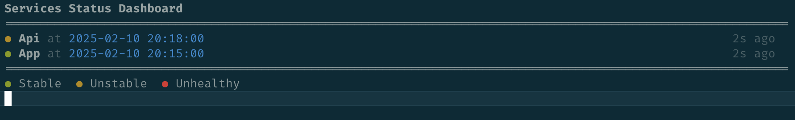

# Updater



## Description

This CLI is a simple tool to monitor the deployment of a service. My service have all a endpoint to check the health of the service who return a simple json with at minimal the buildAt field.

```json
{
  "buildAt": "2025-02-11T10:00:00Z"
}
```

This project will track the buildAt field and when the buildAt is different from the previous buildAt, it will notify the user with a bell sound.

A service can have multiples states, for example:

Old Service: A
New Service: B

| State                       | T - 5 | T - 4 | T - 3 | T - 2 | T - 1 |   T   | Reason                                                                       |
| --------------------------- | :---: | :---: | :---: | :---: | :---: | :---: | ---------------------------------------------------------------------------- |
| Stable Stale (It's healthy) |  `A`  |  `A`  |  `A`  |  `A`  |  `A`  |  `A`  | The build is stable but the service is not updated.                          |
| Unstable                    |  `A`  |  `B`  |  `A`  |  `B`  |  `B`  |  `A`  | The build is switching from service A to service B, not totally on B for now |
| Stable and up to date       |  `B`  |  `B`  |  `B`  |  `B`  |  `B`  |  `B`  | The build is stable and the service is up to date.                           |
| Dead                        | `Err` | `Err` | `Err` | `Err` | `Err` | `Err` | The service is not working at all.                                           |

I want to be notified when the service is passing from one state to another.
For me it's especially usefull when I'm deploying to know when the new version is fully available.

## Usage

```bash
cargo run
```

## Config

The config is a simple toml file that contains the hosts to monitor.

```toml
interval = 5000  # interval in ms between each check
stability_window = 5 # Default is 5, it's the number of consecutive same value to consider the service as stable

[[hosts]]
name = "App" # The name of the host to display
url = "http://localhost:8000" # The url of the host to monitor

[[hosts]]
name = "Api"
url = "http://localhost:8001"
```

## Test the CLI

You can try the CLI by running in another terminal the command: `(You need to have deno installed)`

```bash
./utils/server.ts
```

This server will keep date rounded for 2min, making a good mock of the use case.

Then run the CLI:

```bash
cargo run
```

You should hear a bell sound when the service is passing from one state to another.
